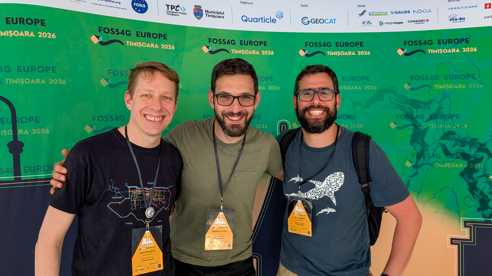

Late June I went to my first FOSS4G conference! FOSS4G Europe 2026 in Timișoara, and on the first day of talks I gave one myself: [From Cron Job to Self-Healing Pipeline](https://talks.osgeo.org/foss4g-europe-2026/talk/JFCDW9/), using Argo and STAC for Earth observation data ingestion. I'll write a separate post going into more detail on the talk and the companion repo I built.

Before the main conference started, I put most of my energy into getting the [eoAPI + STAC workshop](https://talks.osgeo.org/foss4g-europe-2026-workshops/talk/HYXDDR/) ready. Preparing it was a really fast way to find out which parts of my own understanding of eoAPI were still fuzzy! I liked running the workshop so much that I submitted an abstract for an eoAPI workshop at [FOSS4G-UK](https://uk.osgeo.org/foss4guk2026/), happening in Leeds later this year in October.

I also really enjoyed participating in other workshops such as the [EOEPCA+ workshop](https://talks.osgeo.org/foss4g-europe-2026-workshops/talk/K98UDC/) run by Richard Conway and James Hinton from Telespazio. I went in mostly to get a good overview of the project as EOEPCA+ is a platform with a lot of components and I wanted to get oriented before some of them show up in my own work. In the end I found the hands-on part the most useful, more than the overview itself.

The second day of the conference I mostly followed the European track. I liked Stefanie Lumnitz's keynote, "[CONTRIBUTING.md for Europe: Time to fork the policy repo?](https://talks.osgeo.org/foss4g-europe-2026/talk/NTJ8QY/)". It described EU policy-making the way you would describe an open-source project's contribution process (where the entry points are, who reviews what). It was the first time I'd heard EU policy explained that way. The talk Jody Garnett co-presented with Antonio Cerciello on the [Cyber Resilience Act deadline](https://talks.osgeo.org/foss4g-europe-2026/talk/XXSJYB/) did something similar for a regulation I had been vaguely aware of and never actually read. The [joint talk](https://talks.osgeo.org/foss4g-europe-2026/talk/GDZ9SQ/) by Stefanie Lumnitz and Marco Minghini on open source and digital sovereignty was really eye-opening for me! Coming from the technical side, it changed how I think about the landscape we build in every day. None of these talks were aimed at a cloud engineer who spends his days on ingestion pipelines, but I got a lot from each of them. 

After my talk at FOSS4G, someone took the time to show me [Temporal](https://docs.temporal.io/temporal), a workflow orchestration tool I had not used before, close enough to what I have been building with Argo Workflows that we had plenty to talk about. I don't have a comparison to offer yet, but this chat gave me ideas for small projects I could do to learn it and understand its benefits for example for application development, or to streamline how we deploy data pipelines across different cloud environments. But it is a great example of how the whole week went: someone recognizes the shape of a problem they have also had, and is happy to start talking with you about their own experience and what they learned along the way.

If you want to know more about "self-healing" geospatial data pipelines, my talk is here: [From Cron Job to Self-Healing Pipeline](https://talks.osgeo.org/foss4g-europe-2026/talk/JFCDW9/), and I'll write more about how I built it in a future post.

